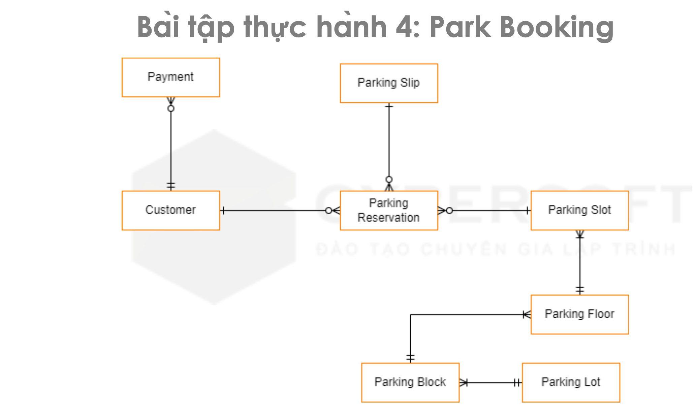

## Description for exercise 01
1. For each Customer, will have one and only one Login. And each Login will belongs to a Customer.
2. For each Customer, will check out one or many Order. And each Order, will belongs to a Customer.
3. For each Order, will be paid by one and only one Payment. And each Payment will belongs to a Order.
4. For each Order, will have one or many Product. And each Product, will belongs to a Order.
5. For each Supplier, will provide one or many Product. And each Product, will belongs to a Suplier.
6. For each Login, will be assigned to many Role. And each Role, will be assigned to many Login.
7. For each Login, will have one and only one Employee/Counter. And each Employee/Counter will belongs to a Login.
8. For each Employee/Counter, will serve one or many Order. And each Order, will belongs to a Employee/Counter.
9. For each Role, will have many Permision. And each Permision, will have many Role.

## Description for exercise 02
1. For each Customer, will pay zero or one or many Invoice. And each Invoice will belongs to a Customer.
2. For each Customer, will check in/out many Room. And each Room will be checked in/our by many Customer.
3. For each Customer, will reserve many Room Price. And each Room Price will be reserved by many Customer.
4. For each Invoice, will have one and only one Bill. And each Bill will belongs to a Invoice.
5. For each Room Price, will have one or many Room Category. And each Room Category will belongs to a Room Price.
6. For each Room Category, will have zero or one or many Room. And each Room will belongs to a Room Category.
7. For each Hotel, will own one or many Room. And each Room will belongs to a Hotel.

## Description for exercise 03
1. For each Department, will have zero or one or many Room. And each Room will belongs to a Department.
2. For each Department, will have zero or one or many Employee. And each Employee will belongs to a Department.
3. For each Room, will have zero or one or many Doctor. And each Doctor will belongs to a Room.
4. For each Doctor is-an Employee.
5. For each Room, will have zero or one or many Patient. And each Patient will belongs to a Room.
6. For each Patient, will register one or many Appointment, also they do not register any Appointment. And each Apointment will belongs to a Patient.
7. For each Doctor, will be assigned to one or many Appointment, also they did not assigned any Appointment.
8. For each Appointment, will have zero or one or many Diagnosis. And each Diagnosis will have zero or one or many Appointment.
9. For each Diagnosis, will prescribe zero or or many Medication. And each Medication will belongs to zero or or many Diagnosis.

## Description for exercise 04
1. For each Customer, will have zero or one or many Parking Reservation. And each Parking Reservation belongs to a Customer.
2. For each Customer, will have zero or one or many Payment. And each Payment belongs to a Customer.
3. For each Parking Slip, will have zero or one or many Parking Reservation. And each Parking Reservation belongs to a Parking Slip.
4. For each Parking Slot, will have zero or one or many Parking Reservation. And each Parking Reservation belongs to a Parking Slot.
5. For each Parking Floor, will have one or many Parking Slot. And each Parking Slot belongs to a Parking Floor.
6. For each Parking Block, will have one or many Parking Floor. And each Parking Floor belongs to a Parking Block.
7. For each Parking Lot, will have one or many Parking Block. And each Parking Block belongs to a Parking Lot.

## Description for exercise 05
1. For each City, will have zero or one or many Repair Shop. And each Repair Shop belongs to a City.
2. For each City, will have zero or one or many Employee. And each Employee belongs to a City.
3. For each Employee, will have zero or one or many Schedule. And each Schedule belongs to an Employee.
4. For each Repair Shop, will have zero or one or many Schedule. And each Schedule belongs to a Repair Shop.
5. For each Position, will have zero or one or many Schedule. And each Schedule belongs to a Position.
6. For each Schedule, will have zero or one or many Contact. And each Contact belongs to a Schedule.
7. For each Contact Type, will have zero or one or many Contact. And each Contact belongs to a Contact Type.
8. For each Customer, will have zero or one or many Contact. And each Contact belongs to a Customer.
9. For each Customer, will have zero or one or many Vehicle. And each Vehicle belongs to a Customer.
10. For each Model, will have zero or one or many Vehicle. And each Vehicle belongs to a Model.

## Description for exercise 06
1. For each User, will have zero or one or many Role. And each Role will have one or many User.
2. For each Book, will have one or many Author. And each Author, will have one or many Book.
3. For each Book, will appear inside one or many Cart, also it can not appear inside any Cart. And each Cart will have one or many Book, the Cart also is an empty cart.
4. For each Category, will have zero or many Book. And each Book will belongs to a Category, it also doesn't belongs any Category.
5. For each Customer, will have zero or many Book. And each Book will belongs to a Customer, it also doesn't belongs any Customer.

## Description for exercise 07
1. For each Room, will have one or many Seat. And each Seat will belongs to a Room.
2. For each Cinema, will have one or many Room. And each Room will belongs to a Cinema.
3. For each Cinema, will have one or many Ticket. And each Ticket will belongs to a Cinema.
4. For each Show, will have one or many Ticket. And each Ticket will belongs to a Show.
5. For each Customer, will have one or many Ticket.
6. For each User, will have zero or many Role. And each Role will have one or many User.
7. An User is-an Employee. And An Employee is-an User.
8. A Customer is-an User.
9. For each Movie, will have zero or many Show. And each Show will have one or many Movie.

## Description for exercise 08
1. For each Bank, will have one or many Branch. And each Branch will belongs to a Bank.
2. For each Bank, will have one or many ATM Machine. And each ATM Machine will belongs to a Bank.
3. For each Operator, will have one or many ATM Machine. And each ATM Machine will have zero or one Operator.
4. For each ATM Techinician, will have one or many ATM Machine. And each ATM Machine will be repaired zero or one ATM Techinician.
5. For each ATM Machine, will receive zero or one or many Card. And each Card will transaction at zero or one or many ATM Machine.
6. For each Customer, will have zero or one or many Card. And each Card will belongs to a Customer.
7. For each Customer, will have zero or one Account.
8. For each Card, will have one or many Transaction. And each Transaction will have one or many Card.
9. Transaction has 3 types is: Withdraw, Transfer, Inquiry.
10. Account has type: Saving.

